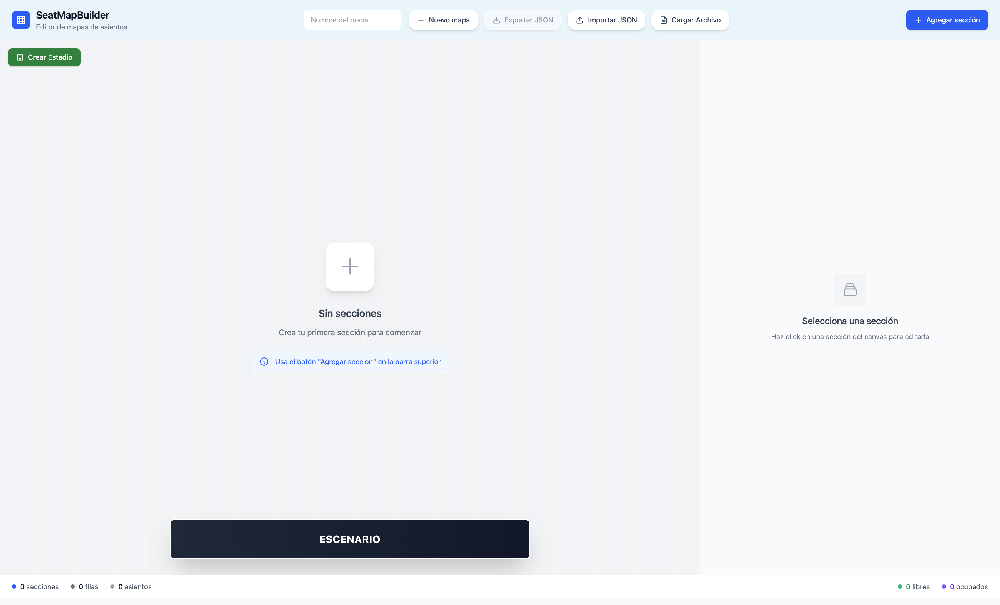
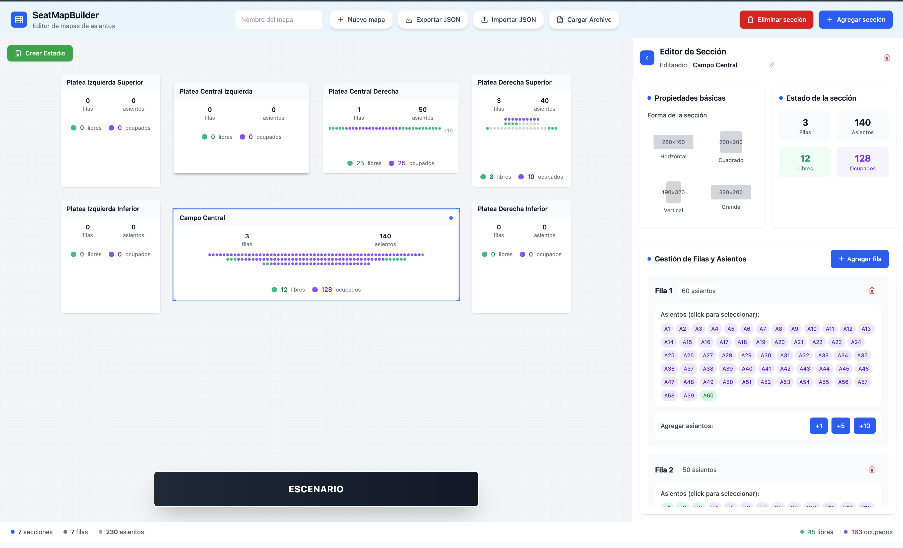

# PruebaTecnicaFanz


----
## Brief:

**SeatMapBuilder** es constructor de mapas de asientos interactivo desarrollado con Next.js y TypeScript. Esta aplicación permite crear, editar y gestionar mapas de asientos para teatros, auditorios y otros espacios con múltiples plateas. Además se pueden importar y exportar mapas en formato .json para trabajar sobre mapas compartidos y no perder los cambios.

## Vista principal




## 🎯 Características Principales

* **Constructor Visual**: Interfaz drag-and-drop para crear mapas de asientos
* **Múltiples Secciones**: Soporte para múltiples secciones (plateas) con filas y asientos
* **Gestión de Estados**: Control de disponibilidad de asientos (libre, ocupado, seleccionado)
* **Exportación/Importación**: Importar y exportar mapas en formato JSON
* **Selección Masiva**: Herramientas para seleccionar y modificar múltiples asientos
* **Estadio Prearmado**: Función para cargar un layout de estadio predefinido
* **Interfaz Moderna**: Diseño limpio con cuadrícula sutil y colores accesibles

## 🚀 Instalación

### Prerrequisitos

* Node.js 18+
* npm o yarn

### Pasos de Instalación

1. **Clonar el repositorio**

``` bash
git clone https://github.com/pgonzaleznunez/PruebaTecnicaFanz.git
cd PruebaTecnicaFanz
```

2. **Instalar dependencias**

``` bash
cd seatmapbuilder
npm install
```

3. **Ejecutar en modo desarrollo**

``` bash
npm run dev
```

4. **Abrir en el navegador**

```
http://localhost:3000
```

## 📦 Scripts Disponibles

``` bash
# Desarrollo
npm run dev          # Ejecuta el proyecto en modo desarrollo
```

## 🏗️ Estructura del Proyecto

```
├── seatmapbuilder/           # Aplicación principal Next.js
│   ├── app/                  # Páginas y layouts de Next.js
│   │   ├── globals.css       # Estilos globales
│   │   ├── layout.tsx        # Layout principal
│   │   └── page.tsx          # Página principal
│   ├── components/           # Componentes React organizados por funcionalidad
│   │   ├── ui/               # Componentes de UI genéricos (camelCase)
│   │   │   ├── button.tsx    # Botón reutilizable
│   │   │   ├── input.tsx     # Input reutilizable
│   │   │   ├── card.tsx      # Card reutilizable
│   │   │   ├── badge.tsx     # Badge reutilizable
│   │   │   ├── checkbox.tsx  # Checkbox reutilizable
│   │   │   ├── select.tsx    # Select reutilizable
│   │   │   ├── textarea.tsx  # Textarea reutilizable
│   │   │   ├── label.tsx     # Label reutilizable
│   │   │   ├── separator.tsx # Separador reutilizable
│   │   │   ├── accordion.tsx # Acordeón reutilizable
│   │   │   └── confirmation-dialog.tsx # Diálogo de confirmación
│   │   ├── seat/             # Componentes relacionados con asientos (PascalCase)
│   │   │   ├── Seat.tsx      # Componente individual de asiento
│   │   │   ├── SeatCanvas.tsx # Canvas para visualización de asientos
│   │   │   ├── SeatEditor.tsx # Editor de asientos
│   │   │   ├── FloatingSeatsPanel.tsx # Panel flotante de asientos
│   │   │   └── SeatsIoRenderer.tsx # Renderizador de Seats.io
│   │   ├── section/          # Componentes relacionados con secciones (PascalCase)
│   │   │   ├── SectionBlock.tsx # Bloque de sección
│   │   │   ├── SectionCanvas.tsx # Canvas principal para mapas
│   │   │   └── SectionEditor.tsx # Editor de secciones
│   │   ├── JsonManager.tsx   # Gestión de archivos JSON
│   │   └── LoadingScreen.tsx # Pantalla de carga
│   ├── lib/                  # Lógica central y esquemas
│   │   ├── schema.ts         # Esquemas de validación Zod
│   │   └── id-generator.ts   # Generador de IDs únicos
│   ├── utils/                # Utilidades generales
│   │   └── utils.ts          # Funciones utilitarias (cn, etc.)
│   ├── tsconfig.json         # Configuración de TypeScript con alias
│   ├── next.config.ts        # Configuración de Next.js con webpack aliases
│   └── ejemplo-json-ids.json # Ejemplo de estructura de datos
├── extra/prompts/            # Herramientas de prompts
│   ├── generate_prompts.py   # Script para generar prompts
│   ├── chat.md               # Historial de conversaciones
│   ├── README.md             # Explicación sobre script generador de prompts 
│   ├── promptsV1.jsonl       # Prompts en formato JSONL de la versión 1.X
│   ├── promptsV2.jsonl       # Prompts en formato JSONL de la versión 2.X
│   └── run.sh                # Script para ejecutar el procesamiento
├── test/                     # Suite de testing para validación JSON
│   ├── package.json          # Configuración de dependencias de testing
│   ├── vitest.config.ts      # Configuración de Vitest
│   ├── README.md             # Documentación de testing
│   ├── fixtures/             # Archivos JSON de prueba
│   │   ├── valid-seatmap.json    # JSON válido completo
│   │   ├── invalid-seatmap.json  # JSON con errores
│   │   └── edge-cases.json       # Casos límite
│   ├── json-validation.test.ts   # Tests de validación JSON
│   └── schema-validation.test.ts # Tests de esquemas Zod
└── README.md                 # Este archivo
```

## 🎮 Uso de la Aplicación

### Crear un Nuevo Mapa

1. **Definir el nombre del mapa** en el campo superior
2. **Agregar secciones** usando el botón "Agregar sección"
3. **Configurar filas** para cada sección
4. **Añadir asientos** a las filas según sea necesario
5. **Cargar estadio prearmado** usando el botón "Cargar Estadio Prearmado" para un layout rápido

### Gestión de Asientos

* **Seleccionar asientos**: Click individual o CMD/Ctrl + click para selección por rango
* **Cambiar estado**: Usar los botones de estado (Libre, Ocupado)
* **Eliminar asientos**: Seleccionar y usar el botón de eliminar con confirmación
* **Agregar asientos**: Botón para añadir asientos a la fila seleccionada
* **Estados visuales**: Asientos circulares con colores distintivos (verde=libre, morado=ocupado, azul=seleccionado)

### Exportar/Importar

* **Guardar mapa**: Usar el botón "Guardar JSON" para descargar el archivo
* **Cargar mapa**: Usar el botón "Cargar JSON" para importar un mapa existente
* **Limpiar mapa**: Botón para resetear el mapa actual

## 💻 Atajos Útiles:

* **Seleccionar varios asientos**: Seleccionar un asiento, mantener presionado CMD/Ctrl + click en otro asiento. Este comando seleccionará todos los asientos entre ambos clicks.
* **Deseleccionar todo**: Presionar ESC o hacer click en un área vacía del canvas.
* **Eliminar secciones**: Seleccionar secciones y presionar DELETE.
* **Colapsar canvas**: Usar el botón de colapso en el editor de sección.

## 🔧 Tecnologías Utilizadas

### Frontend

* **Next.js 15.5.4** \- Framework React con SSR
* **React 19.1.1** \- Biblioteca de UI
* **TypeScript 5.9.2** \- Tipado estático
* **Tailwind CSS 4.1.13** \- Framework de estilos
* **Framer Motion 12.23.22** \- Animaciones

### Herramientas de Desarrollo

* **ESLint** \- Linter de código
* **PostCSS** \- Procesador de CSS
* **Autoprefixer** \- Prefijos CSS automáticos

### Validación y Utilidades

* **Zod 3.23.8** \- Validación de esquemas
* **clsx** \- Utilidad para clases CSS condicionales
* **Lucide React** \- Iconos SVG

## 📊 Estructura de Datos

El mapa de asientos se almacena en formato JSON con la siguiente estructura:

``` json
{
  "name": "Movistar Arena",
  "sections": [
    {
      "id": "section-s1",
      "label": "Platea Izquierda Superior",
      "x": 135,
      "y": 80,
      "width": 220,
      "height": 250,
      "rows": [
        {
          "id": "fila-s1f1",
          "label": "Fila 1",
          "seats": [
            {
              "id": "seat-s1f1n1",
              "x": 0,
              "y": 0,
              "label": "A1",
              "status": "available"
            },
            {
              "id": "seat-s1f1n2",
              "x": 0,
              "y": 0,
              "label": "A2",
              "status": "occupied"
            }
            // más asientos...
          ]
        }
      ]
    }
  ]
}


```

## 🧪 Testing

### Suite de Validación JSON
El proyecto incluye una suite completa de testing para validar la estructura y formato de los archivos JSON:

```bash
# Ejecutar todos los tests
cd test/
npm test

# Tests específicos
npm run test:json      # Validación de archivos JSON
npm run test:schema    # Validación de esquemas Zod
```

### Cobertura de Tests
- ✅ **Validación positiva**: Archivos JSON válidos
- ✅ **Validación negativa**: Archivos con errores
- ✅ **Casos límite**: Valores extremos y vacíos
- ✅ **Esquemas Zod**: Seat, Row, Platea, SeatMap
- ✅ **Integridad de datos**: Consistencia después de validación

## 🧪 Extra

**Desarrollado por Pedro González Núñez**

